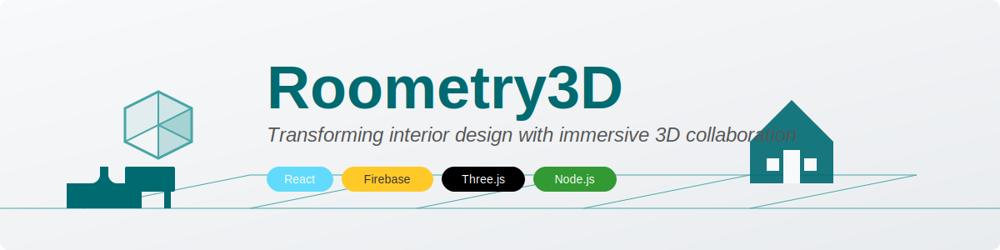
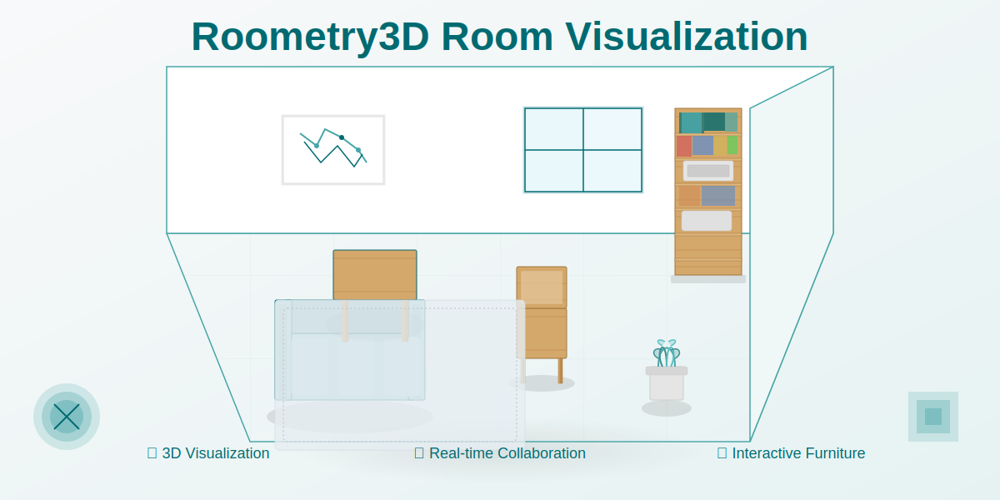

<div align="center">

# 🏠 Roometry3D



### *Transforming interior design with immersive 3D collaboration*

[](https://reactjs.org/)
[](https://firebase.google.com/)
[](https://nodejs.org/)
[](https://threejs.org/)
[](https://expressjs.com/)

</div>

<p align="center">
  
</p>

## 📋 Overview

**Roometry3D** bridges the gap between design vision and reality, offering a collaborative platform where clients, designers, and furniture specialists converge to bring interior spaces to life in three dimensions.

> "Design is not just what it looks like and feels like. Design is how it works." — Steve Jobs

<br/>

## ✨ Key Features

<table align="center" style="width: 100%; border-collapse: collapse;">
  <tr>
    <td align="center" width="33%" style="padding: 15px;">
      <h3>🏡 3D Visualization</h3>
      <p>Experience spaces in interactive 3D with realistic lighting and textures</p>
    </td>
    <td align="center" width="33%" style="padding: 15px;">
      <h3>👥 Collaboration</h3>
      <p>Connect clients and designers in a shared creative environment</p>
    </td>
    <td align="center" width="33%" style="padding: 15px;">
      <h3>🪑 Furniture Library</h3>
      <p>Extensive 3D furniture catalog with detailed specifications</p>
    </td>
  </tr>
  <tr>
    <td align="center" style="padding: 15px;">
      <h3>📱 Responsive Design</h3>
      <p>Seamless experience across desktop and mobile devices</p>
    </td>
    <td align="center" style="padding: 15px;">
      <h3>🔐 Role-Based Access</h3>
      <p>Tailored interfaces for clients, designers, and administrators</p>
    </td>
    <td align="center" style="padding: 15px;">
      <h3>🔄 Real-time Updates</h3>
      <p>Instant synchronization of changes across all users</p>
    </td>
  </tr>
</table>

<br/>

## 🚀 Feature Details

### User Management
- **Multi-role System** — Admin, Designer, and Client roles with tailored capabilities
- **Secure Authentication** — Email-based registration with password protection
- **Profile Customization** — Personalized user profiles with preferences

### Project Workflow
- **Intuitive Creation** — Simple project setup with client-designer pairing
- **Collaborative Editing** — Real-time updates and notifications
- **Version Tracking** — Progress history from initial concept to final design
- **One-click Sharing** — Instant project URL generation for team sharing

### 3D Furniture Management
- **Model Import** — Support for OBJ file format with automatic optimization
- **Texture Library** — Multiple material options for each furniture piece
- **Precise Dimensions** — Accurate sizing and proportions
- **Categorized Browsing** — Organized furniture catalog for easy discovery

### Interactive Visualization
- **Dynamic Controls** — Intuitive orbit, pan, and zoom functionality
- **Texture Switching** — Live preview of different material options
- **Animation Options** — Automated rotation and movement for better showcasing
- **Fullscreen Mode** — Immersive viewing experience

### Administrative Tools
- **User Dashboard** — Comprehensive user management interface
- **Analytics** — Usage statistics and project metrics
- **Furniture Management** — Complete catalog administration

<br/>

## 🛠️ Technology Stack

<div align="center">

### Frontend
[](https://reactjs.org/)
[](https://threejs.org/)
[](https://github.com/pmndrs/react-three-fiber)
[](https://reactrouter.com/)

### Backend
[](https://nodejs.org/)
[](https://expressjs.com/)
[](https://firebase.google.com/)
[](https://firebase.google.com/products/firestore)

</div>

<br/>

## 🔍 Project Structure

```
roometry3d/
├── 📁 frontend/             # React application
│   ├── 📁 public/           # Static assets
│   └── 📁 src/
│       ├── 📁 components/   # Reusable UI elements
│       ├── 📁 pages/        # Main application views
│       ├── 📁 services/     # Firebase integration
│       └── 📁 utils/        # Helper functions
├── 📁 backend/              # Express server
│   ├── 📄 index.js          # API endpoints
│   ├── 📄 firestore.rules   # Database security
│   └── 📄 storage.rules     # File storage config
```

<br/>

## ⚡ Getting Started

### Prerequisites
- Node.js 16.x or later
- npm or yarn
- Firebase account

<details>
<summary><b>📥 Installation Steps</b></summary>

1. **Clone the repository**
   ```bash
   git clone https://github.com/your-username/roometry3d.git
   cd roometry3d
   ```

2. **Install dependencies**
   ```bash
   # Backend setup
   cd backend
   npm install

   # Frontend setup
   cd ../frontend
   npm install
   ```

3. **Configure Firebase**
   - Create a new Firebase project
   - Enable Firestore, Storage, and Authentication services
   - Set up your configuration in:
     - `frontend/src/services/firebase.js`
     - `backend/serviceAccountKey.json`

4. **Start development servers**
   ```bash
   # Launch backend (port 3001)
   cd backend
   npm start

   # Launch frontend (port 3000)
   cd ../frontend
   npm start
   ```

5. **Open your browser**
   - Frontend: [http://localhost:3000](http://localhost:3000)
   - API: [http://localhost:3001](http://localhost:3001)
</details>

<br/>

## 👥 User Roles

<table>
  <tr>
    <th width="33%">👑 Administrator</th>
    <th width="33%">🎨 Designer</th>
    <th width="33%">👤 Client</th>
  </tr>
  <tr>
    <td valign="top">
      <ul>
        <li>Manage all system users</li>
        <li>Control furniture catalog</li>
        <li>Access analytics dashboard</li>
        <li>Configure system settings</li>
      </ul>
    </td>
    <td valign="top">
      <ul>
        <li>Create design projects</li>
        <li>Customize furniture layouts</li>
        <li>Collaborate with clients</li>
        <li>Upload custom models</li>
      </ul>
    </td>
    <td valign="top">
      <ul>
        <li>View project visualizations</li>
        <li>Provide design feedback</li>
        <li>Browse furniture options</li>
        <li>Track project progress</li>
      </ul>
    </td>
  </tr>
</table>

<br/>

## 📸 Screenshots

<div align="center">
  
  
</div>
<div align="center" style="margin-top: 10px;">
  
  
</div>

<br/>

## 📄 License

This project is licensed under the MIT License - see the LICENSE file for details.

<br/>

## 🙏 Acknowledgements

- [React Three Fiber](https://github.com/pmndrs/react-three-fiber) for 3D rendering
- [Firebase](https://firebase.google.com/) for backend services
- [Express](https://expressjs.com/) for API development
- [Three.js](https://threejs.org/) for 3D graphics
- [React](https://reactjs.org/) for UI components

<br/>

---

<div align="center">
  
  
  <p>© 2025 Roometry3D Team • <a href="mailto:contact@roometry3d.com">contact@roometry3d.com</a></p>
  
  <p>
    <a href="https://github.com/your-username/roometry3d" style="text-decoration: none; margin: 0 10px;">
      
    </a>
    <a href="https://twitter.com/roometry3d" style="text-decoration: none; margin: 0 10px;">
      
    </a>
    <a href="https://linkedin.com/company/roometry3d" style="text-decoration: none; margin: 0 10px;">
      
    </a>
  </p>
</div>
